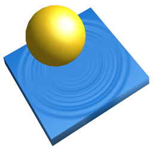

# *Dive* 

**Table of contents**

*   [Definition](#definition)
*   [Details](#details)
*   [Requirements](#requirements)
*   [Documentation](#documentation)
*   [Contact](#contact)
*   [Useless facts](#useless-facts)

----

## Definition

The *Dive* project is a media content finder which allows to search for data on various storage devices without requiring the devices containing the data itself.

[Top](#dive-)

## Details

As already mentioned, *Dive* basically is a media content finder which allows to search data on storage media that is currently not inserted or connected.

The project consists of two components, a content file builder and a content finder. These are portable, which means that you can copy the created content files e. g. onto a memory stick along with the *Dive* project files to use it from various systems. Details about the components can be found inside the [wiki](../../wiki#components).

On April 2018 the project has officially been discontinued. Details can be found [here](https://github.com/urbanware-org/dive/wiki#end-of-life).

[Top](#dive-)

## Requirements

### General

In order to use *Dive*, the *Python* framework must be installed on the system.

Depending on which version of the framework you are using:

*   *Python* 2.x (version 2.7 or higher is recommended, may also work with earlier versions)
*   *Python* 3.x (version 3.2 or higher is recommended, may also work with earlier versions)

### *Deep Dive* feature

This allows to additionally store the content information of certain archive file types. Details about the supported archive types and the corresponding requirements can be found [here](https://github.com/urbanware-org/dive/wiki#deep-dive-feature).

[Top](#dive-)

## Documentation

In the corresponding `docs` sub-directories, there are plain text files containing a detailed documentation for each component with further information and usage examples.

[Top](#dive-)

## Contact

As mentioned above, this project has been discontinued. For this reason, no new features will be implemented, existing features will not be enhanced and remaining bugs will not be fixed either.

However, if you have questions about it, you can contact me by sending an email to <dev@urbanware.org>.

[Top](#dive-)

## Useless facts

Whoever cares can find them [here](../../wiki#useless-facts).

[Top](#dive-)
